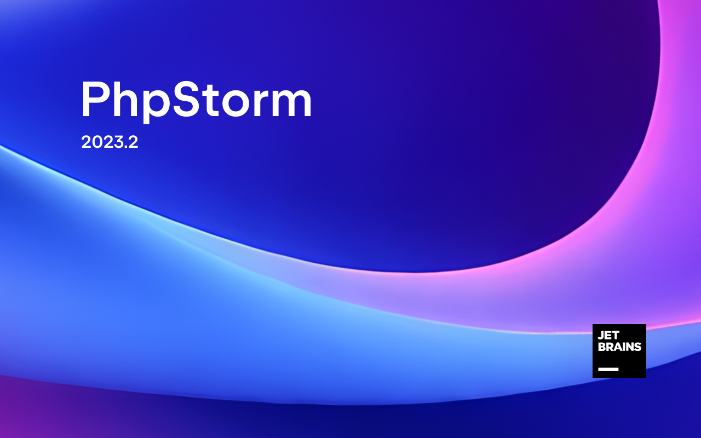

<!-- markdownlint-disable MD033 MD045 -->

# JetBrains splash screens[2024.3]

JetBrains IDE splash screens(启动画面) <https://gitee.com/feuyeux/splash-screens>

## 1 [CLion](https://www.jetbrains.com/clion/)

[//]: # (![nova]&#40;img/nova_splash@2x.png&#41;)

Path(路径)："lib/product.jar/artwork/splash@2x.png"

## 2 [GoLand](https://www.jetbrains.com/go/ )

Path(路径)："lib/product.jar/artwork/splash@2x.png"

## 3 IntelliJ [IDEA](https://www.jetbrains.com/idea/) Community Edition

Path(路径)："lib/app.jar/idea_community_logo@2x.png"

[//]: # (## IntelliJ [IDEA]&#40;https://www.jetbrains.com/idea/&#41; Ultimate)

[//]: #
[//]: # (![idea]&#40;img/idea_logo@2x.png&#41;)

[//]: #
[//]: # (Path&#40;路径&#41;："lib/product.jar/idea_logo@2x.png")

## 4 [PyCharm](https://www.jetbrains.com/pycharm/ ) Community

Path(路径)："lib/app-client.jar/pycharm_core_logo@2x.png"

[//]: # (## [PyCharm]&#40;https://www.jetbrains.com/pycharm/ &#41; Professional)

[//]: #
[//]: # (![pycharm]&#40;img/pycharm_logo@2x.pngx&#41;)

[//]: #
[//]: # (Path&#40;路径&#41;："lib/app.jar/pycharm_logo@2x.png" | "lib/product.jar/artwork/pycharm_logo@2x.png")

## 5 [Rider](https://www.jetbrains.com/rider/)

Path(路径)："lib/app.jar/rider/artwork/release/splash@2x.png"

## 6 [RustRover](https://www.jetbrains.com/rustrover/ )

Path(路径)："lib/product.jar/artwork/splash@2x.png"

## 7 [WebStorm](https://www.jetbrains.com/webstorm/ )

Path(路径)："lib/app.jar/artwork/webide_logo@2x.png"

## 8 [PhpStorm](https://www.jetbrains.com/phpstorm/ )

Path(路径)："lib/app.jar/artwork/webide_logo@2x.png"
